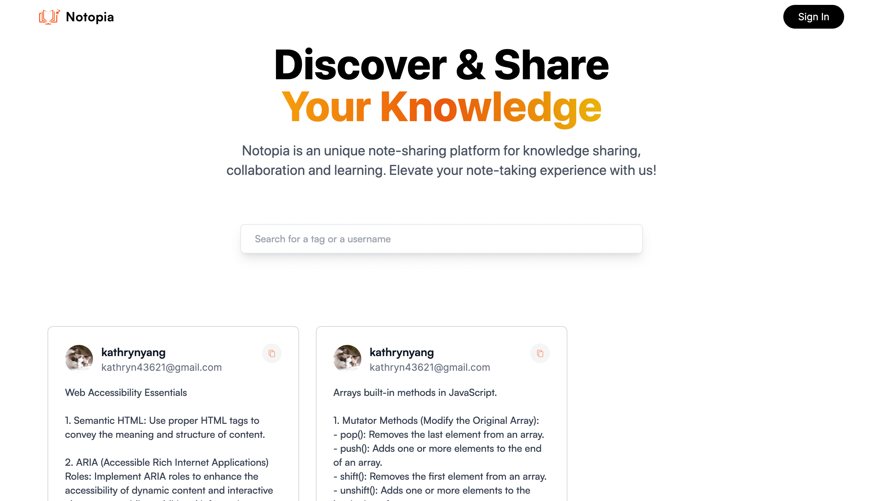
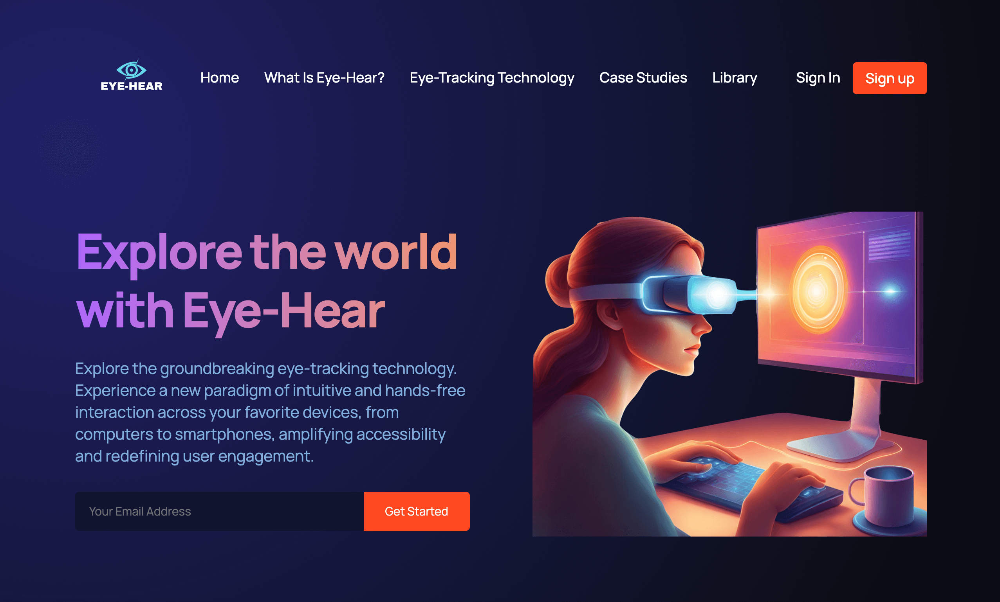

## Portfolio: [Visit here](https://portfolio-kathryn-yangs-projects.vercel.app/)

I welcome you to explore my Portfolio Site, including links to my recent projects and ways to connect with me.

## How It's Made:

Tech used: HTML, CSS, JavaScript, React, Next.js

## Optimisations

When I improve this project, I would like to start by adding the following functionalities:

- Light & Dark Mode: This feature aims to provide users with the flexibility to choose between different visual themes based on their preferences or environmental conditions, ensuring optimal readability and reducing eye strain.

- Color Contrast: To ensure sufficient colour contrast between text and background elements to improve readability for users with low vision or color blindness.

- Focus Indicators: To implement interactive elements, such as links and form controls, have visible focus indicators to indicate their active state when navigating with a keyboard.

- User testing: To assess the accessibility features of the website by engaging users who rely on assistive technologies like screen readers. This process aims to gather valuable feedback from users, enabling iterative improvements based on their insights and enhancing the overall website experience.

## Lessons Learned:

- Performance Optimisation: I've learnt the importance of code splitting, lazy loading, and optimising images to reduce page load times.

- Responsive Design: I've learnt the importance of using media queries, testing on different devices, and ensuring touch-friendly interactions to ensure the website looks and functions well across various devices and screen sizes.

- Accessibility: I've learnt to implement proper semantic HTML, and provide descriptive alt text for images. The next step will be testing with users with assistive technologies.

- State Management: I've learnt how to utilise the right state management for managing data and UI components.

## More Project:

Visit my other projects

[Notopia](https://notopia-kathryn-yangs-projects.vercel.app/)

[Wedding RSVP](https://wedding-mockup-1.netlify.app/)

[Eye-hear](https://eye-hear.netlify.app/)

